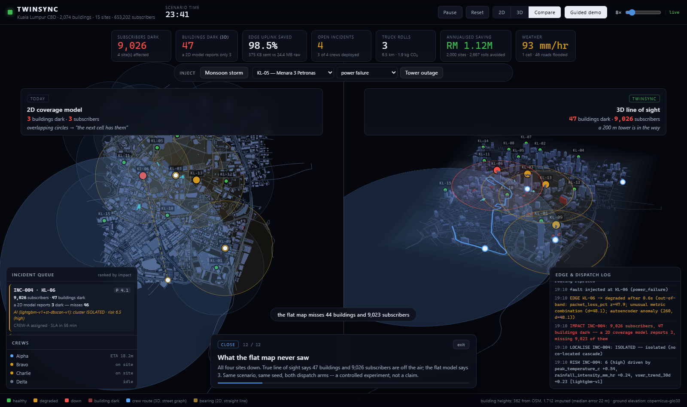
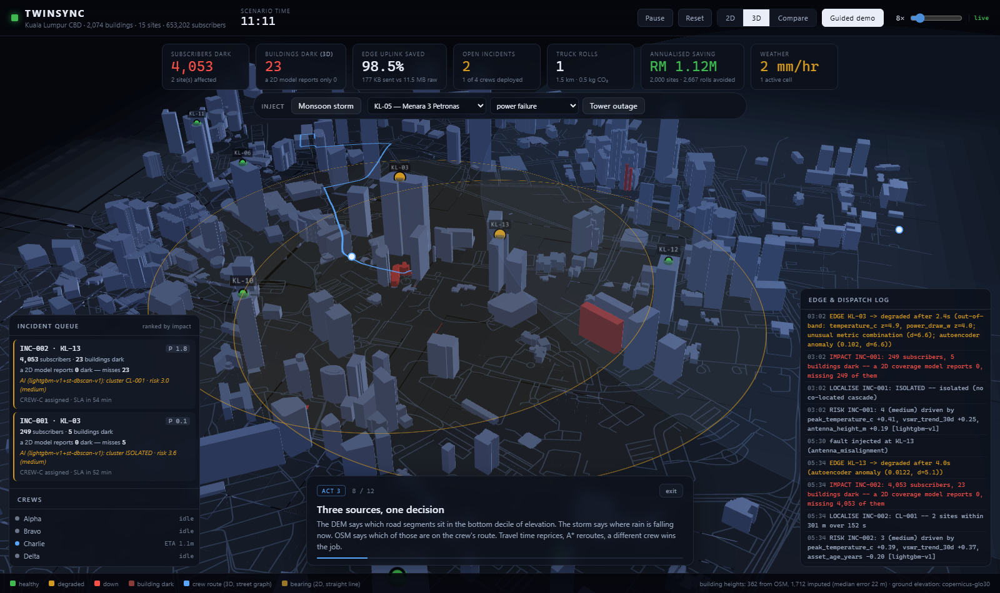
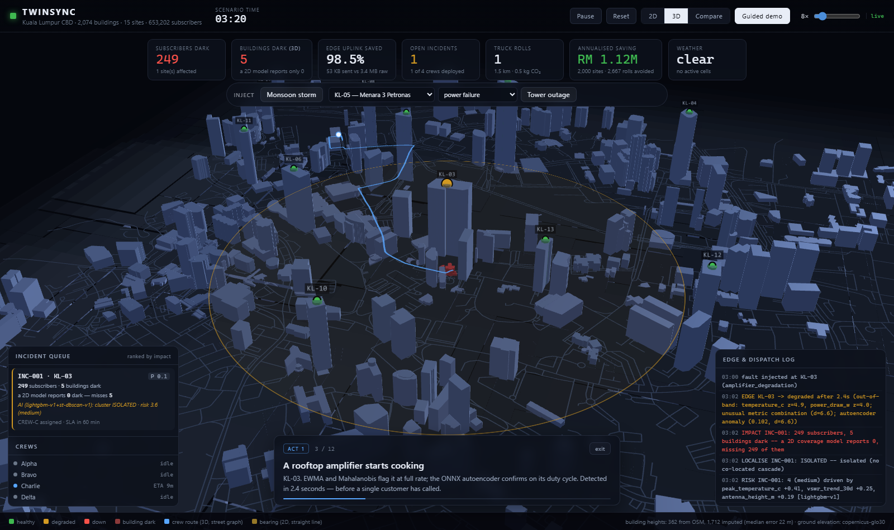

# TwinSync — Real-Time Operational Digital Twin for Field Efficiency

**ASEAN GeoAI Fusion 2026 · Theme: Efficiency · Kuala Lumpur CBD**

[](https://github.com/chewkeanhong/HACK_MY_071---TwinSync-Real-Time-Operational-Digital-Twin-for-Field-Efficiency/actions/workflows/tests.yml)

> **A 2D map cannot tell you who lost signal, because signal is blocked in 3D — and that
> is why crews get sent to the wrong place.**



Left is the flat coverage model dispatch uses today. Right is true line of sight,
ray-cast against terrain and extruded buildings. **Same fault, same instant, same
towers.** The flat map reports 3 buildings dark and concludes the neighbouring cell has
the rest. It is wrong, because a 200 m tower stands in the way.

Three numbers, all measured by code in this repository:

| | |
|---|---|
| **9,023 people** | that a flat coverage map says are fine, and who are actually off the air |
| **10 min → 2.4 s** | time to detect, because inference runs on the tower instead of waiting for a complaint |
| **RM 1.12M / year** | avoided across a 2,000-site network — projected from a controlled A/B run, assumptions on screen and clickable |

---

## Run it

```bash
docker compose up            # → http://localhost:8000
```

or without Docker:

```bash
pip install -r requirements.txt
python -m uvicorn twinsync.server:app --port 8000
```

Then press **`D`** for the guided demo: it restarts the scenario and narrates the whole
cascade itself, so nothing depends on remembering the script. See
[DEMO_SCRIPT.md](DEMO_SCRIPT.md) for the beat-by-beat.

**Runs entirely offline.** No map tiles, no CDN, no API keys — deck.gl is vendored, the
roads are drawn from our own GeoJSON, the DEM grid, the Sentinel-2 NDVI bake and both
model artifacts are committed. Conference wifi cannot break this demo.

```bash
python -m twinsync.sim --scenario data/scenario.json --seed 42   # headless, both arms
pytest tests/ -q                                                 # 175 tests
python scripts/verify_ui.py http://127.0.0.1:8000 shots/         # real browser
```

That last one is not optional before a rehearsal. This dashboard fails *silently* — a
blank WebGL canvas with a clean console and a HUD that looks perfectly healthy — and that
script is the only thing that catches it.

---

## What is real and what is simulated

The single most useful thing this README can do is tell you which claims have a file
behind them. Full detail in [MODEL_CARDS.md](MODEL_CARDS.md); `GET /api/models` reports
the same thing live, with artifact hashes.

| Component | Status |
|---|---|
| **Copernicus DEM GLO-30** | **Real data** — tile `N03_00_E101_00` off the AWS open-data bucket, baked to `data/terrain.json`. Feeds Fresnel clearance, the ST-DBSCAN Z axis, and flood-prone road detection. |
| **Sentinel-2 NDVI encroachment** | **Real observation** — scene `S2B_47NRD_20240323_0_L2A`, 2024-03-23, 4.7 % cloud, via the Element84 STAC on AWS. Median NDVI over a 120 m feeder-corridor buffer per site, SCL cloud/shadow masked. Baked to `data/ndvi.json`. |
| **OSM footprints + height imputation** | **Real data**, imputed heights honestly labelled — see the MAE story below. |
| **3D coverage** | **Real** — ray-casting with a 60 % first-Fresnel clearance criterion over terrain and buildings. |
| **ST-DBSCAN fault localisation** | **Real algorithm** — [twinsync/stdbscan.py](twinsync/stdbscan.py). Two radii, true core/border/noise labels, 3D distance using DEM-derived antenna altitude. Not a trained model, so there is no artifact to ship. |
| **Edge anomaly inference** | **Real ONNX artifact** — `models/edge_anomaly_fp32.onnx`, 3.0 KB, served by onnxruntime. Trained on simulated healthy telemetry. |
| **LightGBM 7-day risk** | **Real trained booster** — `models/risk_lgbm.txt`. ROC-AUC **0.674** against a Bayes ceiling of **0.687** for this hazard function — 93 % of the achievable lift, because failure is a ~2 % weekly coin and the rest of the variance is the coin, not the model. Trained on **synthetic** labels from a documented hazard model. |
| **SHAP explainability** | **Real** — exact TreeSHAP from `pred_contrib`, computed per incident. The tooltip numbers differ per tower because they are actually computed. |
| **Monsoon weather** | **Real physics, synthetic scenario** — ITU-R P.838 rain fade on 18 GHz backhaul. The storm cells are authored, not observed. |
| **Asset age / maintenance history** | **Invented.** No asset register exists for this prototype; derived deterministically from the site id. The weakest input to the risk model, and listed as such on its model card. |

Two things worth stating plainly:

- **The models are trained on synthetic data.** No public dataset of telecom site
  failures exists. The models, training and validation are real; the ground truth is
  generated by scripts in this repo, with every assumption documented in the script that
  makes it.
- **The ML never dispatches anything.** [twinsync/priority.py](twinsync/priority.py) is
  the deterministic, auditable dispatcher. The risk score is advisory context shown to a
  human — which is the honest place for a model trained on synthetic labels. This is not
  an aspiration: swapping the invented vegetation feature for the real Sentinel-2
  observation moved the risk inputs across the whole fleet and changed the A/B outcome by
  **exactly zero**.

---

## Measured results

The "today" column is not an assumption — it is the *same scenario, seed, world and
crews* run through a baseline dispatch mode (FIFO, nearest-by-distance, no batching, no
edge inference). It is a controlled experiment, not a marketing claim.

| metric | today | TwinSync |
|---|---|---|
| MTTD — detect | 10.0 min | **0.04 min** (2.4 s) |
| MTTL — localise | n/a | **0.04 min** |
| MTTR — restore (mean) | 40.3 min | **35.7 min** (−11 %) |
| MTTR — p90 | 41.6 min | 44.7 min |
| truck rolls | 4 | **3** |
| distance driven | 9.3 km | **6.8 km** |
| CO₂ | 2.7 kg | **2.0 kg** |
| crew utilisation | 50.7 % | 50.5 % |
| subscriber-minutes lost | 444,581 | **401,026** |
| SLA uptime | 98.866 % | **98.977 %** |
| cost of truck rolls | RM 1,680 | **RM 1,260** |
| edge uplink | 61.8 MiB raw | **942 KiB (−98.5 %)** |

### What that is worth at network scale

One hour, three faults, fifteen sites is a demo. The projection onto an operator's
network is arithmetic on top of it, and every step is stated because every step is
arguable:

```
measured per incident:  0.33 truck rolls · RM 140 · 0.83 km · 14,518 subscriber-minutes
        × 2,000 sites  (assumption)
        × 4 faults/site/year  (assumption)
        = 8,000 incidents/year
```

| | per year |
|---|---|
| truck rolls avoided | **2,667** |
| cost avoided | **RM 1,120,000** |
| distance not driven | 6,629 km |
| CO₂ | 1.95 t |
| subscriber-hours restored | 1,935,784 |

**The two multipliers are the weakest part of this number, so the dashboard lets you
change them.** Click the "annualised saving" tile and it cycles 2,000 → 5,000 → 10,000 →
500 sites live; `GET /api/metrics?sites=5000&incidents_per_site=6` does the same over
HTTP. The per-incident savings underneath are measured; only the scaling is assumed.

**The 11 % MTTR gain is honest and modest**, because on-site repair time dominates and is
identical in both arms. The large wins are detection (10 min → 2.4 s) and backhaul
(−98.5 %).

**And the p90 is worse, deliberately shown.** Batching a second job onto an in-flight trip
is what removes the truck roll, and it also makes that second job wait. The mean improves,
the tail does not. Reporting only the mean would hide a real trade-off an operator would
want to know about before adopting this.

### The headline 3D number

With the scenario's four towers down, a fair 2D coverage model — inside a failed circle,
outside every healthy one — reports **3 buildings dark, 3 subscribers**. True 3D
line-of-sight over terrain, with Fresnel clearance, says **47 buildings, 9,026
subscribers**.

**The flat map misses 9,023 people who are genuinely off the air.** It does not raise a
false alarm; it says "the neighbouring cell has them" and is wrong.

> A note on what *not* to claim: simply counting everything inside the failed towers'
> circles gives 1,054 buildings against a true 47, which looks like a far more impressive
> number and is a strawman — no operator reasons that way, because they can see the
> neighbouring circles overlapping. Both flat readings are wrong; only the one that
> leaves people off the air is worth putting on a slide. Locked down in
> `tests/test_coverage.py`.

---

## Where the fusion actually happens



The competition asks for multi-source geospatial fusion, so it is worth naming the one
path that touches three sources at once and changes a decision:

```
Copernicus DEM  ──► which road segments sit in the bottom decile of elevation
monsoon cell    ──► where rain is falling right now, and how hard
OSM road graph  ──► which of those segments are on the crew's route
                         │
                         ▼
              travel time repriced → A* reroutes → different crew wins the job
```

That is visible live: press **`S`** and watch the flooded segments light up cyan and the
crew routes change.

Four independent real geospatial sources feed the twin — Copernicus GLO-30 elevation,
OSM footprints and roads, a named Sentinel-2 L2A scene, and ITU-R P.838 rain physics.

### The GeoAI components

| # | Component | What it does |
|---|---|---|
| 1 | **Copernicus DEM ingest** | GLO-30 tile → 30 m elevation grid; ground truth for the Z axis |
| 2 | **Height imputation** | Random forest fills the 83 % of footprints OSM has no height for |
| 3 | **3D line-of-sight coverage** | Ray-casts antenna → facade against terrain *and* extruded buildings, at 60 % Fresnel clearance |
| 4 | **Sentinel-2 NDVI** | Vegetation encroachment per site, from a cloud-masked optical scene |
| 5 | **Edge anomaly detection** | EWMA + Mahalanobis at full rate, ONNX autoencoder on a duty cycle |
| 6 | **ST-DBSCAN localisation** | Groups alarms in space, time and fault family; isolates the ones that are genuinely unrelated |
| 7 | **LightGBM risk + SHAP** | 7-day failure probability with per-incident attributions |
| 8 | **Monsoon weather** | Drifting cells; ITU-R P.838 rain fade on backhaul, DEM-derived road flooding |
| 9 | **Impact-ranked dispatch** | A\* on travel time, trip batching, priority preemption, flood rerouting |

---

## Measured performance

### The edge tier

From [scripts/bench_edge.py](scripts/bench_edge.py) on an AMD Ryzen (Family 25),
Python 3.14.4, onnxruntime 1.29.0. Every timing claim in this project comes from that
script; nothing here is asserted by hand.

| stage | cadence | p50 | p95 | p99 |
|---|---|---|---|---|
| EWMA z-score | every sample | 1.8 µs | 1.9 µs | 2.3 µs |
| Mahalanobis | every sample | 2.6 µs | 2.7 µs | 2.7 µs |
| Autoencoder (ONNX) | 1 in 20 | 14.4 µs | 15.3 µs | 22.7 µs |
| IsolationForest (fallback) | fallback only | 1894 µs | 1935 µs | 2162 µs |
| **full `observe()`** | every sample | 11.8 µs | 29.5 µs | 31.6 µs |

Model on disk **3.0 KB**. A 15-tower fleet of live detectors adds **1.2 MB** RSS (80 KB
per tower — the network is tower-agnostic so one `InferenceSession` is shared). At 10 Hz
that fleet uses **0.08 % of one core**. The exported model is **126× cheaper** than the
IsolationForest it replaced, which is what makes the confirmation stage affordable on
constrained hardware.

### Does it scale past fifteen towers?

The projection above reaches 2,000 sites, so this is the fair question to ask, and
[scripts/bench_twin.py](scripts/bench_twin.py) answers it against the real
2,074-building AOI with synthetic sites placed on real rooftops:

| sites | coverage precompute (build time) | ST-DBSCAN p95 | frame p95 (step + snapshot) | % of the 4 Hz budget |
|---|---|---|---|---|
| 15 | 26.3 s | 0.07 ms | 1.5 ms | 0.6 % |
| 45 | 135.2 s | 0.36 ms | 4.3 ms | 1.7 % |
| 90 | 327.9 s | 2.19 ms | 8.8 ms | 3.5 % |

**Runtime cost is linear in sites** — 6× the fleet costs 6.0× the frame — and a 90-site
AOI spends 3.5 % of its frame budget. Extrapolating that line, one process holds roughly
700 sites at a comfortable quarter of budget.

Two honest caveats:

- **ST-DBSCAN is the wall.** It builds the full neighbour matrix rather than using a
  spatial index, which is the right trade at 15 sites and quadratic beyond it: 31× the
  cost for 6× the fleet. It is still only 2.2 ms at 90 sites, so it has not been worth
  fixing — but a spatial index is what fixes it, and past a few hundred simultaneous
  alarms it would need to.
- **Coverage precompute grows faster than linearly** and reaches 5.5 minutes at 90 sites.
  It is a *build-time* cost: the result is fingerprinted against the scene and cached
  (`data/coverage_cache.json`), so the demo and the container start in seconds. It would
  need partitioning before a national bake.

---

## Things that turned out to be false

Recorded because each one would have been repeated on stage as fact.

**The invented vegetation feature was overstating risk across the entire fleet.** The
hashed stand-in it replaced produced a mean encroachment pressure of **0.59**. The real
Sentinel-2 observation says **0.10** — median NDVI 0.109, range 0.046 to 0.346 across the
fifteen sites. A dense CBD simply has very little vegetation near its rooftop sites, and
the plausible-looking guess had no way to know that. Two consequences worth stating: the
feature now sits at the extreme low end of the distribution the model was *trained* on
(`rng.beta(2, 3)`, mean 0.4), which is a train/serve skew documented on the model card;
and it is a weak feature, so correcting it changed mean risk scores by 0.02 points on a
0–100 scale. Locked down in `tests/test_encroachment.py`.

**Height imputation is much weaker than it first appeared.** Three successive numbers
were wrong:

| reported MAE | why it was wrong |
|---|---|
| 33.4 m | neighbour features were computed from all labels, leaking the test set |
| 3.2 m | the wider training area *contains* the CBD — all 362 surveyed buildings appeared twice, so CV scored a building against its own duplicate at distance zero |
| 3.6 m | after dedup, still scored on the wider area, which is mostly identical terraced houses whose neighbours share their exact height |

**The defensible figure is MAE 36.0 m, median error 22 m, R² 0.23**, cross-validated on
held-out *CBD* buildings only. Adding 14,394 wider-area labels changed it by 0.3 m —
suburban heights do not transfer to high-rise. Production answer is LiDAR/DSM, not more
OSM. Imputed buildings are tinted differently in the UI so a guess never reads as a survey.

**MTTR measured from detection made early detection worthless by construction.** An
outage found after an hour and fixed in twenty minutes scored better than one caught
instantly and fixed in twenty-five. The clock now starts when service broke.

**Isolation Forest alone caused 18 false alarms per 2,000 samples.** `contamination=0.02`
means it flags ~2 % of *normal* data by design. It is now calibrated against its own
training window and can only corroborate, never trip the alarm alone.

**An EWMA fast enough to track drift is fast enough to learn a fault as normal.** At
α=0.05 a 16 dB RSSI collapse was never detected — the mean slid down with it. α=0.002 was
chosen by sweeping both failure modes (see the table in `edge/detector.py`).

**Two of four crews could reach nothing.** Depots had snapped onto road stubs clipped by
the AOI boundary. Snapping is now restricted to the largest *strongly* connected component.

**INT8 quantisation was tried and rejected.** At ~700 parameters INT8 is *larger* than
FP32 (4.8 KB vs 3.0 KB — the Quantize/Dequantize nodes cost more than the weights they
save), and quantisation noise (0.119) sits two orders of magnitude above the decision
threshold (0.001123), so the quantised graph flags **51 % of healthy traffic**. Both
artifacts are committed so the comparison can be re-run.

**The event log froze on the previous run every time the demo restarted.** A frame posted
just before the reset landed repainted the log and carried the seen-event counter up to
the old run's total, after which every event of the new run had a lower id and was
silently dropped — a full log of stale entries under a clock reading 00:57. Found by
`scripts/verify_ui.py`, which now asserts the invariant.

---

## Driving the demo by hand

The guided track runs on its own, but the cascade can be triggered by hand — which is what
to do if a judge asks "what if it rains".

| control | key | what happens |
|---|---|---|
| **Guided demo** | `D` | restarts the scenario at 8× with the caption track |
| **Monsoon storm** | `S` | a cell enters upwind and drifts across: rain fade on the 18 GHz backhaul, low-lying roads flood, dispatch reroutes |
| **Tower outage** | `F` | fails the selected site with the selected profile |
| 2D / 3D / Compare | `1` `2` `3` | the flat model, true line of sight, or both side by side |
| speed slider | — | 1×–60× simulated time |

The cascade to narrate, end to end:

`storm drifts in → rain fade degrades backhaul → edge ONNX confirms the anomaly →
ST-DBSCAN groups nearby alarms into one cluster and marks the unrelated one isolated →
LightGBM re-scores with rainfall as a live feature → flooded roads reprice → dispatch
reroutes and preempts`

Trigger two nearby towers inside the 10-minute window and they share a cluster id;
trigger a distant one and it comes back `ISOLATED`. That contrast is the clearest
one-click proof the clustering is real rather than a label generator.



---

## Architecture

```
Browser — deck.gl (vendored)   terrain · buildings · outage shadow · storm cells · crews
    ▲ WebSocket, 4 Hz full state snapshots
FastAPI — simulation clock · coverage · dispatch · weather · metrics
    ▲ events only, never raw telemetry
Edge agents — per-tower telemetry + local ONNX anomaly inference

Baked in once, read at runtime:
    Copernicus DEM GLO-30 ──► data/terrain.json ──► Fresnel clearance
                                                ├─► ST-DBSCAN Z axis
                                                └─► flood-prone roads
    Sentinel-2 L2A ────────► data/ndvi.json ────► vegetation encroachment
    OSM footprints + height imputation ─────────► extruded city
    models/*.onnx, models/risk_lgbm.txt ────────► edge + risk inference
```

The browser is a pure renderer; the server owns the clock. Building geometry goes over
HTTP once, so only mutable state rides the socket — a full snapshot each frame, not a
delta.

| path | role |
|---|---|
| `twinsync/geo.py` | numpy geometry, local projection, grid index |
| `twinsync/terrain.py` | DEM sampling, slope, path profiles, flood proneness |
| `twinsync/encroachment.py` | baked Sentinel-2 NDVI lookup, with provenance |
| `twinsync/coverage.py` | 3D LOS raycasting with Fresnel clearance, fingerprinted cache |
| `twinsync/routing.py` | street graph, A\* on travel time, congestion, flooding |
| `twinsync/dispatch.py` | assignment, batching, preemption (`smart=False` = baseline) |
| `twinsync/stdbscan.py` | spatio-temporal fault localisation |
| `twinsync/risk.py` | LightGBM scoring + per-incident TreeSHAP |
| `twinsync/weather.py` | drifting storm cells, ITU-R P.838 rain fade, flooding |
| `twinsync/metrics.py` | MTTD/MTTL/MTTR, truck rolls, fuel, CO₂, SLA uptime, ROI projection |
| `twinsync/sim.py` | headless simulation, both arms |
| `edge/detector.py` | three detectors on two cadences, ONNX confirmation stage |
| `edge/intelligence.py` | adapter over the localiser and the risk scorer |
| `scripts/` | data pipeline, model training, benchmarks, browser smoke test |

### Prototype infrastructure

`docker compose up` is the whole deployment: one image, no database, no broker. That is
possible because the world is baked into GeoJSON artifacts and runtime state is
in-process.

A production deployment would add what this v0.1 deliberately leaves out, and it is worth
being precise about what each piece would carry rather than listing technologies:

| production component | what it would hold | why it is absent here |
|---|---|---|
| PostGIS | footprints, road graph, coverage sets | the AOI is 2,074 buildings; GeoJSON on disk is faster and diffable |
| TimescaleDB | raw telemetry history for retraining | nothing is retrained at demo time |
| MQTT broker | the real edge→core event path | simulated payloads are passed straight into FastAPI handlers |
| object store | DEM tiles, Sentinel-2 scenes | one tile and one scene, both baked and committed |

Keeping them out is what makes a judge's setup a single command. Adding them is a
deployment exercise, not a research one.

### Two performance notes

`IsolationForest.score_samples` costs **~1.9 ms per call**, and that is almost entirely
fixed overhead — scoring 15 rows costs the same as scoring one. At 10 Hz across 15 towers
it would need a third of a CPU core. Two things fixed that: running the cheap tests every
sample and the expensive one on a duty cycle, then replacing the forest with a 3 KB
exported network at **15 µs**.

deck.gl reads its container's size when it builds its canvas. Constructing it before
layout settles yields a canvas that reports correct dimensions and **never paints** — the
3D scene is silently blank while the HUD, being plain DOM, looks perfectly healthy.
`boot()` now waits for `load` plus two animation frames.

---

## Reproducing the data

Needs `pip install -r requirements-dev.txt`.

```bash
python scripts/fetch_osm.py --bbox 3.140,101.705,3.162,101.725 --out data
python scripts/impute_heights.py --in data/buildings.geojson \
       --train-extra data/train_buildings.geojson --report
python scripts/place_towers.py --n 15
python scripts/fetch_dem.py --data data           # Copernicus GLO-30 → data/terrain.json
python scripts/fetch_ndvi.py --data data          # Sentinel-2 L2A   → data/ndvi.json
python scripts/make_scenario.py --out data/scenario.json
python scripts/train_edge_model.py --out models/  # ONNX anomaly autoencoder
python scripts/train_risk_model.py  --out models/ # LightGBM + SHAP plots
python scripts/bench_edge.py --iterations 5000    # the edge latency table
python scripts/bench_twin.py --sites 15,45,90     # the scale table
```

Both fetchers derive everything from the AOI coordinates, so pointing them at another
ASEAN city is a matter of changing the bbox; the server honours `TWINSYNC_DATA` to run
against a different bake.

Overpass is unreliable — during this build it returned 504s, 429s and SSL errors, and one
tile needed five attempts across all four mirrors. The fetcher rotates mirrors, backs off,
tiles the AOI and caches every tile, so a re-run resumes. **The committed GeoJSON is the
artifact; the demo never touches the network.**

The dashboard stills in this README are generated, not hand-taken:

```bash
python scripts/verify_ui.py http://127.0.0.1:8000 docs/shots --capture
```

---

## Future work

- **A real asset register** would replace the hash-derived age and maintenance features,
  which are now the weakest inputs to the risk model.
- **Temporal validation** for the risk model — sites are held out, but weeks are not held
  out forward in time.
- **A spatial index for ST-DBSCAN**, which is the measured wall in the scale table above.
- **Partitioned coverage precompute**, so baking a national network is not one long job.
- **A second ASEAN AOI.** The data pipeline is coordinate-driven rather than tuned to
  Kuala Lumpur, and `tests/test_portability.py` holds that line: the Copernicus tile
  naming resolves correctly for Jakarta, Bangkok, Manila, Hanoi, Singapore and Phnom
  Penh — including the southern-hemisphere floor a naive `int()` would get wrong by
  100 km — and no runtime module contains an AOI coordinate. `TWINSYNC_DATA` already
  points the server at a different bake.

  What is missing is the bake and the hand-tuning around it. The scripted timeline is
  authored against *this* fleet's geometry — which two sites are close enough to batch,
  which one is far enough to isolate — so a second city needs that timeline written, not
  just the data fetched. Scoped out of this prototype deliberately.

## Licence

MIT — see [LICENSE](LICENSE).
